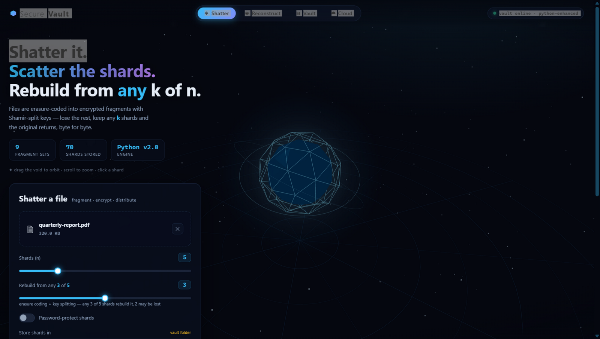
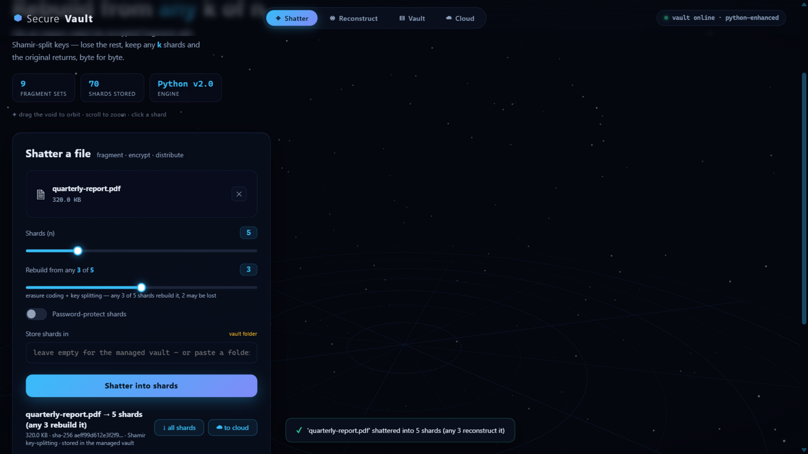
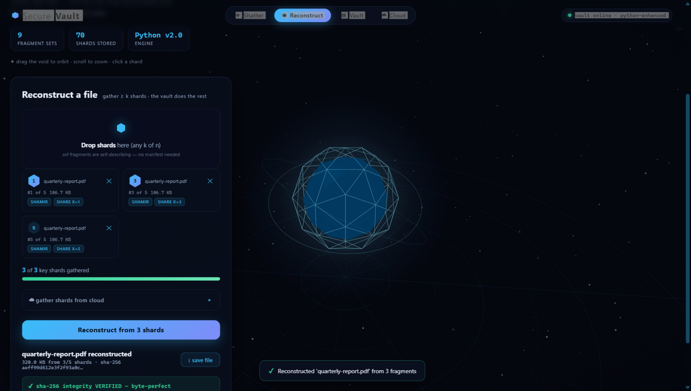
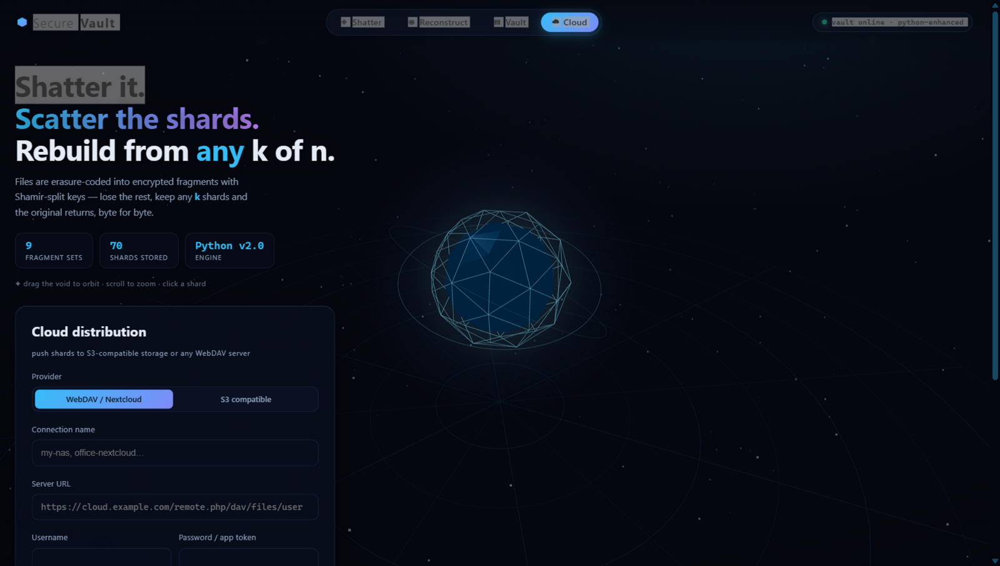
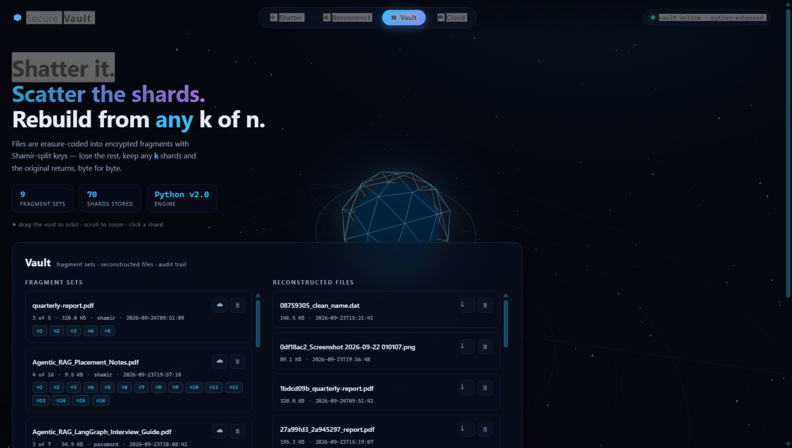

<div align="center">

# ⬡ Swift-Split 2.0
### Secure File Distribution & Reconstruction System

**Split any file into encrypted, self-healing fragments. Lose some. Rebuild the original from *any* k of n shards — byte for byte.**

[](https://python.org)
[](https://fastapi.tiangolo.com)
[](https://threejs.org)
[](LICENSE)
[](#testing)

</div>

---

## ✨ What is Swift-Split 2.0?

Swift-Split 2.0 is a **cross-platform secure file fragmentation system** that splits any file into encrypted shards using **Cauchy Reed-Solomon erasure coding** and **Shamir's Secret Sharing** — then reconstructs it byte-for-byte from any `k` of the `n` shards you stored.

> Drop a PDF, an MP4, an archive — it shatters into `n` numbered shards. Store them anywhere (local, S3, Nextcloud). Later, grab *any* `k` of them — the original comes back, integrity-verified.

### Why use it?
- 🔐 **End-to-end encryption** — AES-256-CBC + scrypt KDF, random IV per shard
- 🧩 **k-of-n threshold** — lose up to `n-k` shards and still recover perfectly
- 🌐 **Cloud distribution** — push shards to AWS S3, Cloudflare R2, MinIO, Nextcloud, ownCloud, or any WebDAV server — zero SDK dependencies
- 🖥️ **Interactive 3D UI** — a WebGL crystal core shatters and reassembles in real time
- 🚀 **No build step, no database, no bundler** — just `pip install` and run

---

## 📸 Screenshots

### 🏠 Hero — 3D Vault Core
The real-time Three.js scene orbits a crystal icosphere that animates on every split and reconstruct operation.



---

### ◈ Shatter Panel — Fragment a file
Choose how many shards (`n`) and the threshold (`k`), optionally password-protect, and hit **Shatter into shards**.



---

### ◉ Reconstruct Panel — Rebuild from any k shards
Drop any `k` `.svf` fragments (or pull them from the cloud). The threshold meter fills as you add shards.



---

### ☁ Cloud Distribution
Connect to any S3-compatible bucket or WebDAV server. Push full sets with one click; reconstruct directly from remote shards.



---

### 🗄️ Vault & Audit Trail
Browse all fragment sets, download individual shards, delete sets, and view a live timestamped audit log of every operation.



---

## 🚀 Quick Start

```bash
# 1. Clone the repository
git clone https://github.com/krrish5235/Swift-split-2.0.git
cd Swift-split-2.0

# 2. Install dependencies (that's everything — no build step needed)
pip install fastapi uvicorn python-multipart cryptography

# 3. (Optional) Run the test suite
cd File_Splitter_Merger_CPP/server
python -m unittest test_server.py

# 4. Launch the server
python -m uvicorn main:app --host 0.0.0.0 --port 8000

# 5. Open in browser
#    http://127.0.0.1:8000
```

Three.js is **vendored** in `frontend/vendor/` — the UI works **fully offline**, no CDN calls, no npm.

---

## 🏗️ Architecture

```
┌──────────── frontend (Three.js scene + glass UI) ────────────┐
│  Shatter · Reconstruct (disk or cloud) · Vault · Cloud       │
└──────────────────────────────┬────────────────────────────────┘
                               │ HTTP (JSON / multipart)
┌──────────────────────────────▼────────────────────────────────┐
│  FastAPI  ──  /api/split  /api/merge  /api/inspect            │
│              /api/vault   /api/cloud/*  /api/audit  /api/health│
└──────┬────────────────────────────────────────┬───────────────┘
       │                                        │
┌──────▼──── engine.py (pure Python) ──┐  ┌────▼── cloud.py (stdlib only) ─┐
│ Cauchy Reed-Solomon erasure code     │  │ S3 SigV4 · WebDAV basic-auth   │
│ Shamir's Secret Sharing GF(2⁸)      │  │ upload / list / fetch / delete  │
│ AES-256-CBC + scrypt KDF             │  └────────────────────────────────┘
│ Self-describing .svf fragments       │
│ SHA-256 integrity everywhere         │
└──────────────────────────────────────┘
```

---

## 🔐 How it Works

### 1. Shatter (Split)
1. The file is **erasure-coded** using a systematic Cauchy Reed-Solomon matrix into `n` shards, where **any `k` of the `n` shards** rebuild the original.
2. A 256-bit content key is generated:
   - **Shamir mode** — the key is mathematically split across shards so fewer than `k` shards reveal *nothing*
   - **Password mode** — the key is derived from your password using `scrypt` (N=16384, r=8, p=1)
3. Each shard is encrypted with **AES-256-CBC** using a per-shard random IV.
4. Every shard gets a **self-describing JSON header** (original filename, shard index, threshold, KDF params, SHA-256 hashes) — no manifest file needed to reconstruct.

### 2. Reconstruct (Merge)
1. Drop any `≥ k` shards — the engine auto-reads their headers.
2. The Shamir shares are combined (Lagrange interpolation over GF(2⁸)) to recover the content key.
3. Each shard is decrypted and the RS decoder reconstructs the original data from any `k` shards using GF(2⁸) matrix inversion.
4. The whole-file SHA-256 is verified — `integrity: verified` or `MISMATCH`.

### Fragment Binary Format

```
magic     7 bytes   b"SVFRG1\0"
hdr_len   4 bytes   uint32 little-endian
header    JSON      original name, size, part i/n, threshold k, mode,
                    IV, KDF params (or Shamir share), SHA-256 hashes
payload   bytes     AES-256-CBC ciphertext (plaintext in "none" mode)
```

---

## 📡 API Reference

| Method | Path | Description |
|---|---|---|
| `POST` | `/api/split` | Fragment a file (`parts`, `threshold`, `mode`, `password`, `destination`) |
| `POST` | `/api/inspect` | Parse fragment headers (drop-zone live preview) |
| `POST` | `/api/merge` | Reconstruct from uploaded shards + optional password |
| `GET` | `/api/vault` | List all fragment sets and reconstructed files |
| `DELETE` | `/api/vault/{id}` | Delete a fragment set |
| `GET` | `/api/download/fragment/{set}/{name}` | Download a single shard |
| `GET` | `/api/download/merged/{name}` | Download a reconstructed file |
| `GET/POST/DELETE` | `/api/cloud` · `/api/cloud/{name}` | Manage cloud connections |
| `POST` | `/api/cloud/{name}/upload/{set}` | Push a set's shards to cloud |
| `GET` | `/api/cloud/{name}/list` | List remote shards |
| `POST` | `/api/cloud/{name}/merge` | Fetch + reconstruct from cloud shards |
| `GET` | `/api/audit` · `/api/stats` · `/api/health` | Audit log / stats / health check |
| `POST` | `/split` · `/merge` | **Legacy v1 endpoints** (backward compatible) |

---

## ☁️ Cloud Storage Support

Swift-Split 2.0 supports **two cloud provider families** — implemented entirely with Python's standard library (no AWS SDK, no third-party libraries):

### S3-Compatible (AWS Signature V4)
- AWS S3, Cloudflare R2, Backblaze B2, MinIO, Wasabi
- Requests signed with AWS Signature V4 (validated against the official AWS test vector)

### WebDAV
- Nextcloud, ownCloud, Synology DSM, Box
- PROPFIND / PUT / GET / DELETE with HTTP Basic Auth

> Credentials are stored **server-side** in `cloud_connections.json` (git-ignored) and never returned to the browser unmasked.

---

## 📁 Project Structure

```
Swift-split-2.0/
├── File_Splitter_Merger_CPP/
│   ├── backend/              Original C++ engine (splitter, crypto, main.cpp)
│   ├── frontend/
│   │   ├── index.html        Main UI (panels: Shatter, Reconstruct, Vault, Cloud)
│   │   ├── app.js            API calls, drag-and-drop, toast notifications
│   │   ├── scene.js          Three.js 3D crystal scene, shatter/reassemble animations
│   │   ├── style.css         Glass-morphism dark UI
│   │   └── vendor/           Vendored Three.js (works fully offline)
│   └── server/
│       ├── main.py           FastAPI application (all endpoints)
│       ├── engine.py         Pure-Python crypto engine (RS, Shamir, AES, scrypt)
│       ├── cloud.py          S3 SigV4 + WebDAV cloud client (stdlib only)
│       ├── test_server.py    Unit & integration test suite (8 tests)
│       └── requirements.txt  Python dependencies
├── docs/
│   └── screenshots/          UI screenshots used in this README
├── requirements.txt          Root-level dependencies for deployment
├── render.yaml               Render.com Blueprint configuration
├── Procfile                  Heroku / Render process file
└── README.md
```

---

## 🧪 Testing

The project ships with a comprehensive automated test suite:

```bash
cd File_Splitter_Merger_CPP/server
python -m unittest test_server.py -v
```

**8 tests covering:**
| Test | Description |
|---|---|
| `test_gf256_operations` | GF(2⁸) arithmetic — mul, pow, inverse |
| `test_shamir_secret_sharing` | Key splitting & threshold recovery across arbitrary subsets |
| `test_reed_solomon_erasure_coding` | All **C(5,3) = 10 shard combinations** reconstruct byte-identically |
| `test_split_and_merge_modes` | Full split→merge cycle in `none`, `password`, `shamir` modes |
| `test_legacy_enc_merge` | Legacy OpenSSL C++ `.enc` fragment compatibility |
| `test_health_and_stats` | `/api/health` and `/api/stats` endpoints |
| `test_split_and_merge_api` | End-to-end FastAPI split→inspect→merge→download flow |
| `test_legacy_enc_merge_api` | Legacy `.enc` merge via the `/api/merge` endpoint |

---

## 🌐 Deploy to Render

[](https://render.com/deploy)

1. Fork / push this repo to your GitHub account.
2. Go to [render.com](https://render.com) → **New** → **Blueprint**.
3. Connect your repository — Render auto-detects `render.yaml`.
4. Set environment variables:
   | Key | Value |
   |---|---|
   | `PYTHON_VERSION` | `3.11.0` |
   | `HOST` | `0.0.0.0` |
5. **Start Command** (auto-filled from `render.yaml`):
   ```
   uvicorn File_Splitter_Merger_CPP.server.main:app --host 0.0.0.0 --port $PORT
   ```
6. Click **Apply** → your app is live with a public HTTPS URL!

---

## 🔒 Security Notes

- Passwords **never leave the page** as plaintext — only used server-side to derive keys.
- Shards are **always encrypted before** any cloud upload — only AES ciphertext leaves the machine.
- Per-shard **random IVs**, scrypt key derivation, constant-time `hmac.compare_digest` for all hash checks.
- In **Shamir mode**, fewer than `k` shards reveal **mathematically zero information** about the content key.

> ⚠️ This is a demonstration-grade system using AES-256-CBC (not AEAD). For production, consider AES-GCM and authenticated headers.

---

## 🛠️ Tech Stack

| Layer | Technology |
|---|---|
| Frontend | Vanilla JS · Three.js (WebGL) · CSS Glass-morphism |
| Backend | Python 3.11 · FastAPI · uvicorn |
| Crypto Engine | AES-256-CBC · scrypt KDF · Shamir's Secret Sharing (GF(2⁸)) · Cauchy Reed-Solomon |
| Cloud | S3 SigV4 (pure stdlib) · WebDAV (pure stdlib) |
| Testing | Python `unittest` · FastAPI `TestClient` |
| Deployment | Render · Procfile · render.yaml Blueprint |

---

## 📄 License

Copyright (c) 2026 Krrish Gupta

All Rights Reserved.

This project, including its source code, documentation, designs, and associated
materials, is the original work of Krrish Gupta.

No permission is granted to copy, modify, distribute, reproduce, publish,
re-upload, sell, or claim this project or any substantial part of it as your
own without prior written permission from the copyright holder.

Viewing and studying this repository for personal, educational, or evaluation
purposes is permitted. Any other use requires explicit permission.

---

## 📜 Copyright & Usage

Copyright © 2026 Krrish Gupta. All Rights Reserved.

Swift-Split 2.0 is an original project developed by Krrish Gupta.

This repository is publicly available for viewing and evaluation. Copying,
redistributing, re-uploading, modifying, or presenting this project as your
own is not permitted without prior written permission.

Original Repository:
https://github.com/krrish5235/Swift-split-2.0

<div align="center">

**⭐ Star this repo if you find it useful!**

[Report Bug](https://github.com/krrish5235/Swift-split-2.0/issues) · [Request Feature](https://github.com/krrish5235/Swift-split-2.0/issues) · [View Demo](https://github.com/krrish5235/Swift-split-2.0)

</div>
